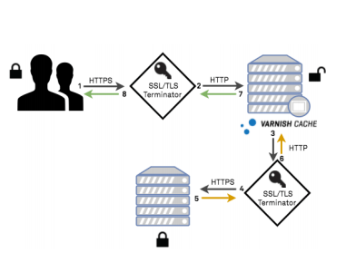

## Menu link
[Home](README.md)\
[About](AboutUs.md)\
[Main Menu]\
[Encryption and Public Keys](Encryption_and_public_keys.md)\
[IP address and DNS](IP_address_and_DNS.md)\
[Packet, routing and Reliability](Packet_routing_and_reliability.md)\
[HTTP(S), TLS, SSL](HTTPS_SSL_TLS_DigitalCertificate.md)\
[Data transmission Methodologies](Wired_and_wireless_data_transmission.md)

## Page Title
HTTP(S), SSL, TLS, Digital Certificate

## Meta Description
**Https comes into the picture whenever there are talks related to money and transactions where security is extremely crucial. TLS and SSL are more of a generalized certificates to secure browsing connections by encrypting the data**

## Keywords
- Web address
- Security protocol
- Digital certificate authentication
- Functioning of web browser
- GET and POST difference
- HTTP and HTTPS

## Page Layout
F layout

## Page Content
[Page Content](HTTPPageContent.md)

## Sidebar Image

## Sidebar Content
[Side bar Content](HTTPSbContent.md)

## Page Image

## Footer
Rajvi Patel\
323 Dr Martin Luther King Jr Blvd\
Newark\
NJ 07102\
<rp83@njit.edu>\
[Linkedin](http://linkedin.com/in/rajvi-patel-4403681b5)\
[Github](https://github.com/raajvipatel99)

Preyasha Patel\
323 Dr Martin Luther King Jr Blvd\
Newark\
NJ 07102\
<pp54@njit.edu>\
[Linkedin](http://linkedin.com/in/preyasha-patel-67356a122)\
[Github](https://github.com/preyasha2810)
