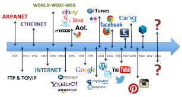

## General Info

### Author names 
Raajvi Patel
Preyasha Patel

### The concept of the website
The main concept for this website is to explain the briefs of Internet History and show various technologies like DNS, IP address, Cryptography, Packet Routing, Wired and Wireless Data Transmissions, HTTP.

## Meta description
**The internet is the global network that exchanges data and media over devices that are interconnected.It uses packet switching mechanism which obeys tcp/ip and where information is sent through wired or wireless mediums and is encrypted for secure data transmission**

## Keywords
- Internet in a nutshell
- Interconnected network
- Full form of ARPA
- Diversity of information
- Mechanics of internet
- Communication facilties
- Growth of internet

# Website Title 
Mechanisms of internet

# Page Title
Internet in a Nut Shell

## Hero Text
Get an insight about the various functionalities of Internet and the technologies that operate around it

## Website Main Menu (Nav bar)
[Home]\
[About](AboutUs.md)\
[Main Menu]\
[Encryption and Public Keys](Encryption_and_public_keys.md)\
[IP address and DNS](IP_address_and_DNS.md)\
[Packet, routing and Reliability](Packet_routing_and_reliability.md)\
[HTTP(S), TLS, SSL](HHTPS_SSL_TLS_DigitalCertificate.md)\
[Data transmission Methodologies](Wired_and_wireless_data_transmission.md)\

## Page Layout
Z Layout

## Page Content
(HomePageContent.md)

## Page Image

## Sidebar Image

## Sidebar Content
(HomePagesbContent.md)

## Footer
**Rajvi Patel**
**323 Dr Martin Luther King Jr Blvd, Newark, NJ 07102**
<rp83@njit.edu>
[Linkedin](http://linkedin.com/in/rajvi-patel-4403681b5)
[Github](https://github.com/raajvipatel99)

**Preyasha Patel**
**323 Dr Martin Luther King Jr Blvd, Newark, NJ 07102**
<pp54@njit.edu>
[Linkedin](http://linkedin.com/in/preyasha-patel-67356a122) 
[Github](https://github.com/preyasha2810)
