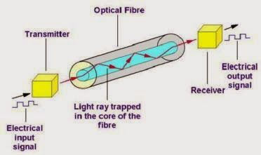
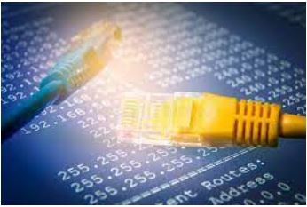

## Menu Link
[Home](README.md)\
[About](AboutUs.md)\
[Main Menu]\
[Encryption and Public Keys](Encryption_and_public_keys.md)\
[IP address and DNS](IP_address_and_DNS.md)\
[Packet, routing and Reliability](Packet_routing_and_reliability.md)\
[HTTP(S), TLS, SSL](HHTPS_SSL_TLS_DigitalCertificate.md)\
[Data transmission Methodologies](Wired_and_wireless_data_transmission.md)

## Page Title
Data Transmission methodologies

## Meta Description
**Internet is a tangible physical system to move binary information. There are different wired and wireless mediums where the ways of communication may differ but the underlying binary data and protocols remain the same**

## Keywords
- Wireless data transmission
- Physical ways of communication
- Binary code
- Signal loss
- Radio signals
- Wired Data Transmission
- Fibre Optic Transmission

## Page Layout
F layout

## Page Content
[Page Content](WiredPageContent.md)

## Sidebar Image

## Sidebar Content
[Sidebar Content](WiredSbContent.md)

## Page Image
 \

## Footer
Rajvi Patel\
323 Dr Martin Luther King Jr Blvd\
Newark\
NJ 07102\
<rp83@njit.edu>\
[Linkedin](http://linkedin.com/in/rajvi-patel-4403681b5)\
[Github](https://github.com/raajvipatel99)

Preyasha Patel\
323 Dr Martin Luther King Jr Blvd\
Newark\
NJ 07102\
<pp54@njit.edu>\
[Linkedin](http://linkedin.com/in/preyasha-patel-67356a122)\
[Github](https://github.com/preyasha2810)
